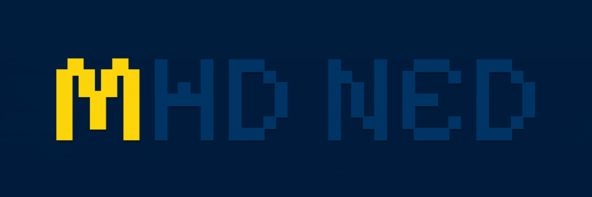

# 

I'm Mehdi Nedaee. During my time in the Programming field, I realized that even though our world as computer people is made of just 0 and 1, we can still create amazing things with them.
 
> _Maybe this vision feels a bit outdated with quantum computing_

I'm a backend developer who’s always learning — not just to build showcase projects or chase money, but to create real, useful software.
I care about building applications that are practical, well-designed, follow clean architecture and standards, and above all, are easy for users to interact with. That mindset pushed me to collaborate with the <a href="https://github.com/FEZtool-team">**FEZtool team**</a> — working on both a web-based app and the FEZrs Python library for remote sensing tools.
If you're curious, make sure to check out the <a href="https://github.com/FEZtool-team">**FEZ organization**</a>!

 

# 

  

  

 

# 

 

 

# 

 

 

# 
### Coming Soon

 

# 
### Coming Soon

 

# 
### Coming Soon

 
